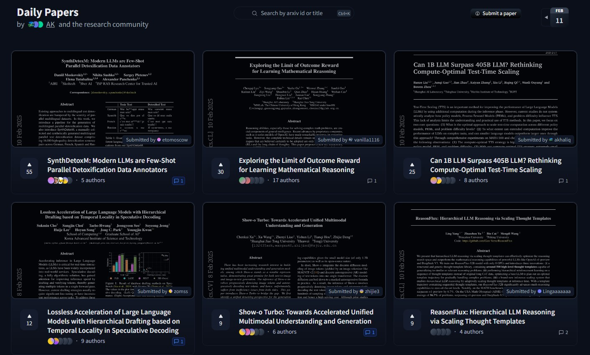

# Daily Papers Analysis

This project aims to analyse the top papers in the AI/ML space. We will use the listed papers in [Hugging Face Daily Papers](https://huggingface.co/papers) for the past year and study the relationship between the papers, authors, and their organizations.

## Datasets
All the details of our target papers is saved as `Assets\papers_details.json`.
These details are used to create the datasets we need to construct the graphs. Our graph datasets are in `GraphDataset` folder:
- `paper.csv`: Contains paper information including ID, publication date, and title
- `author.csv`: Contains author information including ID and name
- `paper_author.csv`: Maps papers to their authors (many-to-many relationship)
- `paper_category.csv`: Maps papers to their research categories (many-to-many relationship)
- `category.csv`: Contains category information including ID and category name/field

